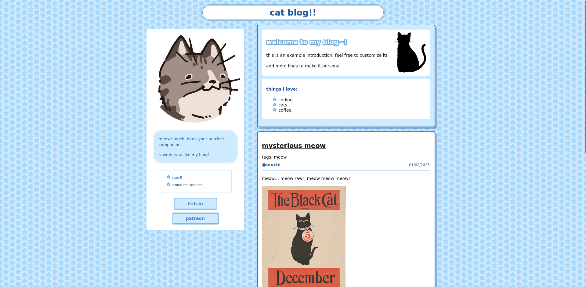

# neopost
*neopost* is a minimalist, customizable theme for personal blogs, inspired by the aesthetics of Neocities. it allows for flexible content management and easy customization of styles through simple configuration.


## installation
```bash
hugo new site my-site
cd my-site
git clone "https://github.com/salatine/neopost.git" themes/neopost
```

### configuration
edit `hugo.yaml` to configure the theme:
```yaml
baseURL: "https://example.com"
theme: "neopost"
params:
    theme: "light-purple"
```
set the desired color by changing the `theme` parameter inside `params`, currently there are `light-blue`, `dark-blue`, `light-green`, `light-yellow`, `light-pink`, `light-purple` as options.

### example site
it's HIGHLY! recommended to test the example provided with the theme, just to learn how to mess with it. you can do that by running (considering you already did the installation steps):
```bash
cp -r themes/neopost/example/. .
hugo serve
```
note: images provided in this example site are mostly taken from the [library of congress](https://www.loc.gov/free-to-use/cats/).

### creating content

#### posts
```hugo new content/posts/new_post.md```
this is most of your stuff, a post will appear at the main page and each one will have a page for itself. you can also attribute tags to your posts, which then can be filtered to easily find specific posts.
you can edit it at `content/posts/new_post.md`.

#### sidebar
```hugo new --kind sidebar sidebar```
the sidebar from the main page, add a bio and little information about you!
you can edit it at the directory `content/sidebar/`, there are multiple markdown files to edit

#### welcome header
```hugo new --kind welcome_header welcome_header```
this is above all the posts in the main page, you can give yourself a better introduction here, and say whatever you want.
you can edit it at `content/welcome_header/_index.md`.

### license
*neopost* is licensed under the [gpl-3.0 license](./LICENSE)
